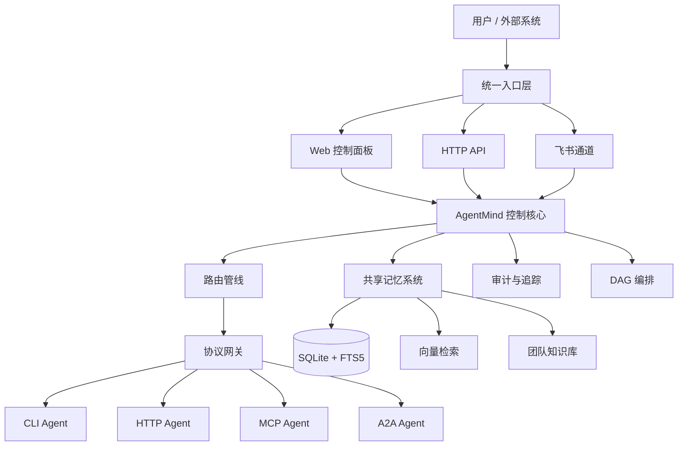

# AgentMind

**带记忆的 异构Agent 指挥中枢。**

AgentMind 不是一个新的 Agent，而是运行在多个 AI 工具之上的统一控制层。它负责发现、管理、路由和编排已有 Agent，让 Claude Code、Codex、Hermes、Aider、Cursor、Warp 等工具可以在同一个入口下协同工作，并把关键任务、上下文和团队知识沉淀为长期记忆。

一句话概括：

> AgentMind 让多个 异构AI Agent 从“各自为战”升级为“可路由、可记忆、可追踪、可编排”的智能协作系统。

## 项目定位

今天的 AI 工具越来越多，但它们通常存在几个共同问题：

- 每个工具都有自己的入口，任务分散，难以统一管理。
- 任务过程缺少持续记忆，历史上下文很难被后续任务复用。
- 多 Agent 协作依赖人工切换，缺少稳定的路由、追踪和审计。
- 外部入口如飞书、HTTP API、MCP、A2A 往往需要重复适配。

AgentMind 的目标是做这些 Agent 之上的“指挥中枢”：

- 统一入口：Web 面板、HTTP API、飞书消息都可以进入同一条任务管线。
- 智能路由：根据显式指定、语义意图、规则、成本、延迟和安全信号选择合适 Agent。
- 共享记忆：把任务结果、历史对话、团队知识、向量语义检索统一纳入上下文。
- 可观测控制：通过指挥舱查看任务、路由、审计、记忆、配置和 Agent 状态。
- 可扩展协议：同时支持 CLI、HTTP API、MCP JSON-RPC 和 A2A 调用协议。

## 核心能力

### 1. Agent 统一管理

AgentMind 启动时会扫描本机环境，自动识别已安装的 AI 工具，并生成可编辑的 Agent 配置。

当前支持：

- Claude Code
- Codex
- Hermes
- Aider
- Cursor
- Warp
- OpenClaw
- 其他可被自动探测的 CLI 工具

运行时会定期健康检查。不可用 Agent 会自动从候选池移除，避免任务被路由到失效工具。

### 2. 智能路由系统

AgentMind 使用分层路由管线处理每一次请求：


路由策略包括：

- 显式指定：例如 `@codex 修改这个文件`
- 语义意图：识别用户真正想完成的任务类型
- 规则策略：基于 `routes.yaml` 的可配置路由规则
- 信号评分：结合能力、成本、延迟、安全约束进行兜底判断
- 安全降级：检测到敏感信息时，优先转向本地 Agent

执行失败时，系统可以按 fallback chain 自动重试，降低单个 Agent 失败带来的中断风险。

### 3. 共享记忆与团队知识库

AgentMind v1 已经具备完整的记忆基础能力。

记忆写入管线包括：

- 任务结果写入
- 类型识别
- 去重
- 重要性评分
- 会话归并
- 分片存储
- Core Memory 更新
- 团队知识抽取
- 向量 embedding 写入

记忆检索管线包括：

- 近期工作记忆
- 长期记忆
- 全文关键词检索
- 向量语义检索
- 团队知识库
- Core Memory
- 关系记忆
- 结果去重与排序

这意味着后续任务不再只依赖当前 prompt，而是可以自动获得历史任务、团队知识和相关上下文。

### 4. 指挥官驾驶舱

AgentMind 提供本地 Web 控制面板，用于查看和管理整个系统。

主要页面包括：

- 指挥舱：系统状态、任务趋势、最近错误、路由状态、审计动态
- 任务台：任务列表、任务详情、时间线、执行解释、输出回放
- Agent 管理：Agent 状态、启停、配置编辑和热加载
- 路由规则：路由策略查看、规则编辑、策略排序
- 记忆库：记忆搜索、团队知识、向量检索、清理和统计
- 编排画布：拖拽式 DAG 工作流编排
- 配置项：飞书通道、语义路由、Embedding、记忆保留等核心配置
- 审计台：记录配置变更、路由决策、记忆访问等关键事件

控制面板不是展示页面，而是 AgentMind 的本地运行控制台。

### 5. 多入口接入

AgentMind 当前支持三类主要入口：

- Web 面板：适合本地管理和可视化操作
- HTTP API：适合程序化调用和系统集成
- 飞书通道：适合团队聊天入口和移动端使用

飞书通道支持：

- WebSocket 长连接
- 面板配置 App ID / App Secret
- 消息到达后自动处理
- 处理状态 reaction
- 完成后自动回复
- 多 Agent 讨论 stop 检测
- 通道侧 replay 指令

### 6. 多 Agent 讨论

AgentMind 支持通过自然语言触发多 Agent 讨论，例如：

```text
@codex @claude 讨论一下这个架构是否合理
```

系统会让多个 Agent 轮流发言，并基于前一位的观点继续补充、反驳或总结。讨论结束后，第一个 Agent 会生成结构化结论，包括：

- 核心结论
- 共识点
- 分歧点
- 行动建议

### 7. DAG 编排

编排画布支持用拖拽方式创建多步骤任务流。

执行逻辑包括：

- 步骤依赖定义
- 循环检测
- 拓扑排序
- 上游结果注入下游 prompt
- 串行执行
- 触发词匹配

这让 AgentMind 可以从“单次任务路由”扩展到“多步骤任务执行”。

## 系统架构



## 快速开始

### 环境要求

- Python 3.10+
- 推荐 macOS / Linux 本地环境；Windows 可在兼容 Python 环境下尝试运行
- 推荐先安装至少一个可被 AgentMind 调用的 AI 工具，例如 Codex、Claude Code 或 Ollama

### 从源码安装

```bash
git clone https://github.com/wangdingding2026/agentmind2026.git
cd agentmind2026
pip install -e .
```

启动：

```bash
agentmind
```

启动后打开：

```text
http://127.0.0.1:8765/panel/
```

如果 `8765` 端口已被占用，AgentMind 会自动尝试后续可用端口。

### 从 GitHub 直接安装

如果仓库是公开仓库，或者当前账号有访问权限，也可以使用：

```bash
pip install git+https://github.com/wangdingding2026/agentmind2026.git
```

然后启动：

```bash
agentmind
```

说明：当前暂未以 `pip install agentmind` 的形式发布到 PyPI。后续如发布 PyPI，可能会根据可用包名调整安装名称。

## HTTP API 示例

AgentMind 会在本地生成认证 token：

```bash
cat ~/.agentmind/config/auth.token
```

调用路由接口：

```bash
TOKEN=$(cat ~/.agentmind/config/auth.token)

curl -H "Authorization: Bearer $TOKEN" \
  -X POST http://127.0.0.1:8765/v1/route \
  -H "Content-Type: application/json" \
  -d '{"message":"写一个 hello world","stream":false}'
```

流式调用可以设置：

```json
{
  "message": "解释这个项目的架构",
  "stream": true
}
```

## 配置目录

AgentMind 的本地数据和配置默认位于：

```text
~/.agentmind/
```

核心配置文件：

```text
~/.agentmind/config/agents.yaml    # Agent 注册和命令模板
~/.agentmind/config/routes.yaml    # 路由规则
~/.agentmind/config/settings.yaml  # LLM、Embedding、飞书、记忆等系统配置
~/.agentmind/config/auth.token     # 本地 API 认证 token
```

常见配置建议：

- 在面板的“配置项”页面填写飞书 App ID 和 App Secret。
- 在“配置项”页面填写语义路由 LLM 和 Embedding 服务。
- 在“Agent 管理”页面检查已发现的 Agent 是否可用。
- 在“路由规则”页面补充特定任务到特定 Agent 的规则。

## 技术栈

- Python 3.10+
- FastAPI
- Uvicorn
- SQLite WAL
- SQLite FTS5
- Server-Sent Events
- YAML 配置
- 可选：Embedding API
- 可选：sqlite-vec 加速向量检索

默认安装不强制依赖 `sqlite-vec`。在网络受限或系统环境复杂时，AgentMind 会使用纯 SQLite 保底方案。

## 当前版本状态

当前版本：`v1.0.0`

AgentMind v1.0.0 是“稳定中枢版”，重点完成以下能力：

- 多入口统一接入
- Agent 自动发现和健康检查
- 多策略智能路由
- CLI / HTTP / MCP / A2A 协议执行
- 共享记忆和团队知识库
- 向量写入、检索和索引重建
- 历史对话查询
- 指挥官驾驶舱
- 飞书真实通道接入
- DAG 编排基础能力
- 审计、任务追踪和运行态可观测

发布前已完成：

- 全量测试通过
- wheel 构建验证
- 干净虚拟环境安装验证
- `agentmind` 命令启动验证
- 控制面板静态资源加载验证
- 飞书、MCP、A2A、外部 LLM、Embedding API 真实端到端验证

## v1 边界

AgentMind v1 已经可以作为本地 AI 指挥中枢使用，但它还不是最终形态。

当前已具备：

- 稳定的本地服务入口
- 可使用的控制面板
- 可扩展的路由和协议架构
- 可持续增长的记忆系统
- 可真实接入外部通道和外部模型的基础能力

后续版本会继续推进：

- 更深的自主任务拆解
- 更完整的多 Agent 协同治理
- 更强的关系图谱和知识演化
- 更完善的权限、团队空间和多用户能力
- 更标准化的安装和发布流程

## 适合场景

AgentMind 适用于以下使用方式：

- 个人 AI 工作台：统一管理本机多个 AI 编程工具。
- 团队 AI 助手中枢：通过飞书等入口把任务分发给不同 Agent。
- Agent 实验平台：验证 MCP、A2A、CLI、HTTP Agent 的协作方式。
- 长期项目助手：让 AI 记住项目历史、架构判断、任务结论和团队知识。
- 本地控制面板：观察任务执行、路由决策、配置变更和记忆检索结果。

## 开发验证

本地开发常用命令：

```bash
python -m compileall -q src tests
python -m pytest -q
```

构建wheel：

```bash
python -m pip wheel . --no-deps -w dist
```


## 许可证

MIT
