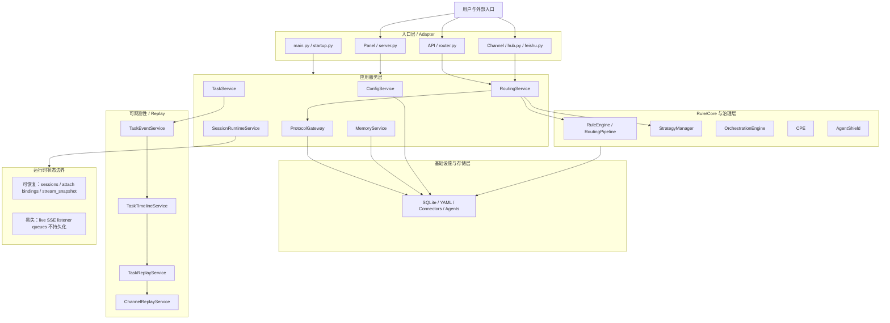

# AgentMind 架构重构优化评估总结

## 评估结论

AgentMind 本轮架构重构优化已经完成，且已达到原计划的架构收口目标。

当前系统已经从“多个入口顺手承担业务逻辑”的状态，收口到更清晰的分层架构：服务层负责真正做事，rule/core 层负责规则和决策，panel/API/channel 只做 adapter。现在不建议继续为了架构本身追加可观测性基建，下一阶段应进入真实使用反馈。

本评估基于 `AGENTMIND_OPTIMIZATION_PLAN.md`、`AGENTMIND_IMPLEMENTATION_PLAN.md`、Phase 3-5 关闭文档、architecture final closeout、task-event closeout 和 observability product closeout。本文档只做评估总结，不新增生产运行行为。

## 当前架构现状

最初的优化目标，是解决 `main.py`、`api/router.py`、`panel/server.py`、通道适配器、配置读取、存储辅助函数和运行时队列之间职责交叉的问题。重构后的架构已经基本符合目标形态：

- 入口和适配层只负责接收协议请求、解析输入、返回响应；
- 服务层负责业务动作、状态读写、运行时组合和 DTO 装配；
- rule/core 层负责路由、编排、治理和策略决策；
- 基础设施层负责 SQLite、YAML、协议 SDK、connector、runtime primitives 等底层能力。

### 架构全景图

```mermaid
graph TB
    %% ===================== 样式 =====================
    classDef adapter fill:#e1f5fe,stroke:#0288d1,stroke-width:2px
    classDef service fill:#e8f5e9,stroke:#388e3c,stroke-width:2px
    classDef core fill:#fff3e0,stroke:#f57c00,stroke-width:2px
    classDef infra fill:#f3e5f5,stroke:#7b1fa2,stroke-width:2px
    classDef runtime fill:#fce4ec,stroke:#c62828,stroke-width:2px,stroke-dasharray: 5 5
    classDef replay fill:#e0f2f1,stroke:#00695c,stroke-width:2px

    %% ===================== 入口层 / Adapter =====================
    subgraph ADAPTER["🔷 入口层 / Adapter 层"]
        direction TB
        MAIN["main.py<br/>FastAPI 装配 & 路由挂载"]
        STARTUP["startup.py<br/>启动生命周期 & 通道自启"]
        ROUTER["api/router.py<br/>HTTP → 路由/任务调用"]
        PANEL["panel/server.py<br/>Panel API & 静态页面"]
        CHUB["channels/hub.py<br/>通道生命周期 & 消息分发"]
        FEISHU["channels/feishu.py<br/>飞书协议收发 & 消息清洗"]
    end

    %% ===================== 服务层 =====================
    subgraph SERVICE["🟢 服务层 (Service Layer) — 业务动作 & DTO 装配"]
        direction TB

        subgraph SVC_CORE["核心业务服务"]
            CONFIG["ConfigService<br/>统一配置读取入口"]
            TASK["TaskService<br/>任务生命周期 owner"]
            ROUTE["RoutingService<br/>路由决策入口"]
            MEMORY["MemoryService<br/>记忆写入/检索/上下文"]
            SESSION["SessionRuntimeService<br/>Panel runtime & attach"]
            AUDIT["AuditService<br/>审计事件 owner"]
        end

        subgraph SVC_REPLAY["Replay & Timeline 服务族"]
            TES["TaskEventService<br/>持久化 task events"]
            TTLS["TaskTimelineService<br/>read-side timeline DTO"]
            TRS["TaskReplayService<br/>replay DTO 边界"]
            CRS["ChannelReplayService<br/>/replay 命令入口"]
            TEXPS["TaskExplanationService<br/>任务解释 read-side"]
        end

        subgraph SVC_CONTROL["控制面服务族"]
            ACS["AgentControlService"]
            RCS["RuleControlService"]
            SCS["SettingsControlService"]
            SSS["SettingsStatusService"]
            CPOS["ControlPlaneOverviewService"]
            CDS["ConnectorDiscoveryService"]
        end

        subgraph SVC_ENGINE["引擎 & 网关"]
            PG["ProtocolGateway<br/>统一 connector 调用"]
            SM["StrategyManager<br/>路由策略注册/排序"]
            ACR["AgentCapabilityRegistry<br/>Agent 能力 profile"]
            OE["OrchestrationEngine<br/>DAG 校验 & 执行"]
        end
    end

    %% ===================== rule/core 层 =====================
    subgraph CORE["🟠 rule/core 层 — 规则 & 决策"]
        direction TB
        RE["rule_engine.py<br/>规则匹配 & 决策 I/O"]
        TRACE["trace.py<br/>Trace 语义边界"]
        ROUTING_LIB["routing/<br/>Pipeline/Context/Envelope"]
        ORCH_LIB["orchestration/<br/>编排模型 & DAG 结构"]
        CPE["governance/cpe.py<br/>CPE 宽松 metadata"]
        SHIELD["governance/agent_shield.py<br/>行为权限宽松"]
        GOVTYPES["governance/types.py<br/>治理决策类型"]
    end

    %% ===================== 基础设施 & 存储 =====================
    subgraph INFRA["🟣 基础设施 & 存储层"]
        direction TB

        subgraph INFRA_STORAGE["存储"]
            DB["storage/db.py<br/>SQLite 基础访问"]
            OLD_MEM["storage/memory.py<br/>旧记忆兼容路径"]
            EMB["storage/embedding.py<br/>Embedding 能力"]
            NEW_MEM_STORE["memory/sqlite_store.py<br/>新记忆 SQLite"]
            MEM_REPO["memory/repository.py<br/>记忆仓储"]
            MEM_SVC["memory/service.py<br/>记忆内部服务"]
            MEM_CD["memory/conflict_detector.py<br/>冲突检测"]
        end

        subgraph INFRA_RUNTIME["运行时原语"]
            CONNECTORS["connectors/<br/>CLI / HTTP / MCP / A2A"]
            AGENTS["agents/<br/>Executor / Registry / Discovery"]
            YAML["YAML 配置文件<br/>settings/agents/routes/orchestrations"]
        end
    end

    %% ===================== 运行时状态（跨层） =====================
    subgraph RUNTIME["🔴 运行时状态边界"]
        direction LR
        RECOVERABLE["可恢复状态<br/>active sessions<br/>attach bindings<br/>stream_snapshot"]
        VOLATILE["易失状态<br/>live SSE listener queues<br/>不持久化 / 不恢复"]
    end

    %% ===================== 连接关系 =====================

    %% adapter → service
    MAIN --> CONFIG
    MAIN --> TASK
    ROUTER --> ROUTE
    ROUTER --> TASK
    PANEL --> SESSION
    PANEL --> TRS
    PANEL -.-> ACS
    PANEL -.-> RCS
    PANEL -.-> SCS
    PANEL -.-> CPOS
    PANEL -.-> CDS
    CHUB --> CRS
    CHUB --> SESSION
    FEISHU --> CHUB
    STARTUP --> CHUB

    %% service 内部：replay 链路
    TASK -->|"产生 lifecycle events"| TES
    TES -->|"查询事件"| TTLS
    TTLS -->|"装配 timeline"| TRS
    TTLS -->|"纳入 timeline"| TEXPS
    TRS -->|"replay DTO"| CRS

    %% service → core
    ROUTE --> RE
    ROUTE --> ROUTING_LIB
    ROUTE --> TRACE
    TASK --> TRACE
    OE --> ORCH_LIB
    SM --> RE
    ACR --> RE
    AUDIT --> CPE
    AUDIT --> GOVTYPES

    %% service → infra
    CONFIG --> YAML
    TASK --> DB
    MEMORY --> NEW_MEM_STORE
    MEMORY --> MEM_REPO
    MEMORY --> OLD_MEM
    PG --> CONNECTORS
    PG --> AGENTS
    ACS --> AGENTS
    CDS --> CONNECTORS
    SESSION --> DB

    %% core → infra
    RE --> YAML
    CPE --> GOVTYPES
    SHIELD --> GOVTYPES
    ROUTING_LIB --> TRACE

    %% runtime 边界
    SESSION -.->|"管理"| RECOVERABLE
    SESSION -.->|"持有"| VOLATILE

    %% ===================== 样式应用 =====================
    class MAIN,STARTUP,ROUTER,PANEL,CHUB,FEISHU adapter
    class CONFIG,TASK,ROUTE,MEMORY,SESSION,AUDIT,TES,TTLS,TRS,CRS,TEXPS,ACS,RCS,SCS,SSS,CPOS,CDS,PG,SM,ACR,OE service
    class RE,TRACE,ROUTING_LIB,ORCH_LIB,CPE,SHIELD,GOVTYPES core
    class DB,OLD_MEM,EMB,NEW_MEM_STORE,MEM_REPO,MEM_SVC,MEM_CD,CONNECTORS,AGENTS,YAML infra
    class RECOVERABLE,VOLATILE runtime
```



**图例说明：**
- 🔷 **入口层**：只做协议适配，不承载业务逻辑
- 🟢 **服务层**：业务动作、状态读写、DTO 装配的主干
- 🟠 **rule/core 层**：规则匹配、路由决策、治理策略
- 🟣 **基础设施层**：存储、connector、agent 运行时原语
- 🔴 **运行时状态**：虚线边框表示跨层边界，区分可恢复与易失
- **实线箭头**：调用/依赖关系
- **虚线箭头**：Panel 控制面访问、运行时管理

### 简化架构总览

```text
                        🌐 用户 / 🖥 面板 / 💬 飞书 / 🔗 API
                                      │
                                      ▼
┌─────────────────────────────────────────────────────────────────────────────────┐
│  通道层（channels）：只负责接消息、发消息、做通道认证                                │
│                                                                                   │
│  channels/hub.py         — 通道生命周期管理、ChannelMessage 标准分发、/replay 入口  │
│  channels/feishu.py      — 飞书协议收发、消息清洗（不承载 replay 语义和路由规则）      │
└─────────────────────────────────────────────────────────────────────────────────┘
                                      │
                                      ▼
┌─────────────────────────────────────────────────────────────────────────────────┐
│  入口层（adapter）：只负责把外部请求变成标准调用                                      │
│                                                                                   │
│  main.py                 — FastAPI 装配 & 路由挂载，不承载业务逻辑                   │
│  startup.py              — 启动生命周期、恢复、通道自启（委托给 ChannelHub）           │
│  api/router.py           — HTTP → 标准路由/任务调用，不拥有任务生命周期               │
│  panel/server.py         — Panel API & 静态页面，handler 只调用服务层               │
└─────────────────────────────────────────────────────────────────────────────────┘
                                      │
                                      ▼
┌─────────────────────────────────────────────────────────────────────────────────┐
│  应用服务层（service）：负责真正办事、组合依赖、产出 DTO                               │
│                                                                                   │
│  ┌─ 核心业务 ─────────────────────────────────────────────────────────────────┐  │
│  │ TaskService            — 任务生命周期 owner（开始→路由→执行→完成→失败）       │  │
│  │ RoutingService         — 路由决策入口，组合策略/审计/CPE metadata             │  │
│  │ MemoryService          — 记忆写入、检索、上下文，新旧记忆边界收敛              │  │
│  │ ConfigService          — 统一配置读取入口（settings/agents/routes/orch）      │  │
│  │ SessionRuntimeService  — Panel 侧 runtime owner（sessions/attach/stream）    │  │
│  │ AuditService           — 审计事件 owner，保留 CPE governance event shape     │  │
│  └───────────────────────────────────────────────────────────────────────────┘  │
│                                                                                   │
│  ┌─ Replay & Timeline 链路 ───────────────────────────────────────────────────┐  │
│  │ TaskEventService       — 持久化 task timeline events owner                  │  │
│  │ TaskTimelineService    — read-side timeline DTO 装配                        │  │
│  │ TaskReplayService      — replay DTO 边界（panel/channel 共用）               │  │
│  │ ChannelReplayService   — /replay <trace_id> 命令解析 & 文本摘要              │  │
│  │ TaskExplanationService — 任务解释 read-side，通过 timeline 纳入上下文        │  │
│  └───────────────────────────────────────────────────────────────────────────┘  │
│                                                                                   │
│  ┌─ 控制面服务族（panel 侧 DTO，不让 panel 直接碰配置/registry）─────────────────┐  │
│  │ AgentControlService / RuleControlService / SettingsControlService            │  │
│  │ SettingsStatusService / ControlPlaneOverviewService / ConnectorDiscovery     │  │
│  └───────────────────────────────────────────────────────────────────────────┘  │
│                                                                                   │
│  ┌─ 引擎 & 网关 ──────────────────────────────────────────────────────────────┐  │
│  │ ProtocolGateway         — 统一 connector 调用面（CLI/HTTP/MCP/A2A）          │  │
│  │ OrchestrationEngine     — DAG 校验、排序、context instruction 构建           │  │
│  │ StrategyManager         — 路由策略注册、启用顺序和列表 owner                  │  │
│  │ AgentCapabilityRegistry — Agent capability profile & scoring input owner     │  │
│  └───────────────────────────────────────────────────────────────────────────┘  │
└─────────────────────────────────────────────────────────────────────────────────┘
                                      │
                                      ▼
┌─────────────────────────────────────────────────────────────────────────────────┐
│  核心规则层（rule/core）：路由策略、记忆流水线、编排规则、安全策略（只做决策，不做适配） │
│                                                                                   │
│  core/rule_engine.py      — 规则匹配 & 决策 I/O，panel/API 不可直接 reload        │
│  core/trace.py            — Trace 语义边界，已从 memory 污染中剥离                 │
│  routing/                 — Pipeline / Context / Envelope / Utils                 │
│  orchestration/           — 编排模型，多 agent DAG & 顺序 & 上下文构建规则          │
│  governance/cpe.py        — CPE 决策（当前宽松：不 block / 不 reroute）            │
│  governance/agent_shield.py — 行为权限边界（当前宽松：不检查 / 不拦截）             │
│  governance/types.py      — 治理决策 & metadata 类型，保留 enforcement 扩展点      │
└─────────────────────────────────────────────────────────────────────────────────┘
                                      │
                                      ▼
┌─────────────────────────────────────────────────────────────────────────────────┐
│  基础设施层：SQLite / YAML / CLI / HTTP / MCP / A2A / 飞书 SDK                     │
│                                                                                   │
│  ┌─ 存储 ─────────────────────────────────────────────────────────────────────┐  │
│  │ storage/db.py           — SQLite 基础访问（服务层之下的存储 primitive）       │  │
│  │ storage/memory.py       — 旧记忆兼容路径（被新服务边界包住）                   │  │
│  │ storage/embedding.py    — Embedding 基础能力（本地优先，外部增强）             │  │
│  │ memory/sqlite_store.py  — 新记忆 SQLite store，承接 MemoryService 持久化      │  │
│  │ memory/repository.py    — 记忆仓储                                          │  │
│  │ memory/service.py       — 记忆内部服务                                       │  │
│  │ memory/conflict_detector.py — 冲突检测                                       │  │
│  └───────────────────────────────────────────────────────────────────────────┘  │
│                                                                                   │
│  ┌─ 运行时原语 ───────────────────────────────────────────────────────────────┐  │
│  │ connectors/  — CLI / HTTP / MCP / A2A connector，统一被 ProtocolGateway 包装  │  │
│  │ agents/      — Executor / Registry / Discovery，通过服务层访问               │  │
│  │ YAML 配置    — 本地优先，访问必须经由 ConfigService 和控制面 service          │  │
│  └───────────────────────────────────────────────────────────────────────────┘  │
└─────────────────────────────────────────────────────────────────────────────────┘

═══ 跨层关注点 ═══

  Replay 数据流：
    TaskService ──(lifecycle events)──▶ TaskEventService ──▶ TaskTimelineService
    ──▶ TaskReplayService ──▶ Panel Replay API / ChannelReplayService(/replay)
    全程走持久化 task timeline events，不依赖 live SSE queue

  运行时状态边界：
    🟢 可恢复 — active sessions / attach bindings / stream_snapshot（SessionRuntimeService 管理）
    🔴 易失   — live SSE listener queues（不持久化、不恢复、服务重启后丢失）

  调用约束（不可违反）：
    上层 ──调用──▶ 下层 ✓
    下层 ──不调用──▶ 上层 ✗
    Adapter ──不直接──▶ 存储 / YAML / rule engine ✗
```

当前关闭状态如下：

- Phase 1 服务层地基已完成。
- Phase 2 记忆与 trace 收口已完成。
- Phase 3 平台核心与控制平面服务边界已关闭。
- Phase 4 控制台运行时与通道边界已关闭。
- Phase 5 宽松治理架构基线已关闭。
- observability/task-event 路线已关闭。
- 可观测性产品化路线已关闭。
- Feishu route_callback fallback 已删除。

## AgentMind 当前架构图



图中的关键约束是：Panel/API/Channel 只做 adapter，服务层负责真正做事，规则层负责规则和决策；运行时状态中 live SSE listener queues 不持久化。

## AgentMind 详细架构现状

### 1. 入口层与 adapter

当前入口层已经从“顺手执行业务逻辑”转为“协议适配和生命周期适配”。

- `src/agentmind/main.py`：应用入口，负责 FastAPI app 装配、路由挂载和基础启动集成，不应重新承载路由、记忆、任务或通道业务。
- `src/agentmind/startup.py`：启动生命周期 adapter，负责启动阶段的恢复、初始化和通道自动启动触发；Feishu 自动启动已经委托给 `ChannelHub`。
- `src/agentmind/api/router.py`：API 请求 adapter，负责把 HTTP 请求转换为标准路由/任务调用，不应直接拥有任务生命周期、记忆写入、trace 规则或 executor 选择逻辑。
- `src/agentmind/panel/server.py`：Panel adapter，负责 panel API、静态页面和请求/响应转换；已迁移的 panel handlers 必须调用服务层，不应直接读写 YAML、遍历 executor、查询任务存储、装配 replay timeline 或控制 Feishu runtime。
- `src/agentmind/channels/hub.py`：通道 glue/service 边界，负责通道生命周期、Feishu routing glue、标准 `ChannelMessage` 分发，以及 Feishu `/replay <trace_id>` 进入 `ChannelReplayService` 的入口。
- `src/agentmind/channels/feishu.py`：Feishu 协议 adapter，负责飞书协议收发和消息清洗，不承载 replay 语义，不承载业务路由规则，不再执行旧 `route_callback` fallback。

这一层的评估结论是：adapter 边界已经基本清晰，后续不能把服务层、rule/core 层或存储层职责重新塞回入口文件。

### 2. 服务层现状

服务层是本轮重构后的主干，负责真正做事、组合依赖和产出稳定 DTO。当前服务层已经覆盖主要业务域：

- `ConfigService`：统一配置读取入口，承接 settings、agents、routes、orchestrations 等配置访问，不让上层直接散读散写 YAML。
- `TaskService`：任务生命周期 owner，负责任务开始、路由、执行、完成、失败等状态生产，并产生 task lifecycle events 和 `partial_output` events。
- `RoutingService`：路由服务入口，组合路由请求、策略、审计和 CPE dry-run metadata，不让 API/channel 直接执行路由决策细节。
- `MemoryService`：记忆系统服务入口，承接新记忆架构下的写入、检索、上下文和兼容边界，避免新旧记忆双轨继续扩散。
- `SessionRuntimeService`：panel-facing runtime owner，负责 active sessions、attach binding、panel task stream、`stream_snapshot` 和启动恢复边界；live listener queue 仍保持易失。
- `ChannelReplayService`：channel replay 命令 owner，负责显式 `/replay <trace_id>` 解析、调用 `TaskReplayService` 和生成简短文本摘要。
- `TaskReplayService`：service-level replay DTO owner，负责面向 panel/channel 的 replay DTO 边界，不让 adapter 自行拼 timeline。
- `TaskTimelineService`：read-side timeline DTO owner，负责基于 `TaskEventService` 的事件查询结果装配 timeline。
- `TaskEventService`：持久化 task timeline events owner，负责 stored task events，而不是 live stream queue。
- `TaskExplanationService`：任务解释 read-side service，通过 `TaskTimelineService` 纳入 timeline 信息。
- `AuditService`：审计事件 owner，保留 CPE governance event shape 和未来 approval/blocked/success 状态映射。
- `ProtocolGateway`：统一 connector invocation surface，承接 CLI、HTTP、MCP、A2A executor/connector 调用边界。
- `StrategyManager`：路由策略注册、启用顺序和列表 owner。
- `AgentCapabilityRegistry`：agent capability profile 和 scoring input owner。
- `OrchestrationEngine`：编排规则和执行路径 owner，负责 DAG 校验、排序、context instruction 构建和 orchestration execution support。
- `AgentControlService`、`RuleControlService`、`SettingsControlService`、`SettingsStatusService`、`ControlPlaneOverviewService`、`ConnectorDiscoveryService`：控制面服务族，负责 panel 侧 agent、rule、settings、status、overview、connector marketplace DTO，不让 panel 直接碰底层配置和 registry。

这一层的评估结论是：服务层已经覆盖了原先最容易混入入口层的能力，后续新增能力也应优先落在服务层或 rule/core 层，而不是落在 API/panel/channel handler。

### 3. rule/core 与治理层

rule/core 层负责规则和决策，而不是协议适配或存储细节。

- `src/agentmind/core/rule_engine.py`：路由规则引擎边界，负责规则匹配和决策输入输出；panel/API 不应直接 reload 或改写规则引擎。
- `src/agentmind/core/trace.py`：trace 相关核心结构和追踪语义边界；trace 已从 memory 污染中剥离，避免把路由追踪当成用户记忆。
- `src/agentmind/routing/`：路由 pipeline、context、envelope 和 utils，承接路由领域结构，服务层通过这些结构组织路由工作。
- `src/agentmind/orchestration/`：编排模型和 engine，承接多 agent DAG、顺序和上下文构建规则。
- `src/agentmind/governance/cpe.py`：CPE 决策边界，当前保持 permissive，不做客户内容检查，不 block、不 reroute、不 require approval。
- `src/agentmind/governance/agent_shield.py`：AgentShield 行为权限边界，当前保持 permissive，不检查 behavior payload，不拦截命令。
- `src/agentmind/governance/types.py`：治理决策和 metadata 类型边界，保留未来 enforcement 扩展点。

这一层的评估结论是：治理和策略已经有可扩展位置，但当前只保留宽松、最小、可观察的 metadata，不启用敏感内容审查和行为拦截。

### 4. 基础设施与存储层

基础设施层保留底层能力，不应向上泄漏业务规则。

- `src/agentmind/storage/db.py`：SQLite/task 等基础数据库访问能力，是服务层之下的存储 primitive。
- `src/agentmind/storage/memory.py`：旧记忆存储兼容路径，应继续被新服务边界包住，不能重新成为上层直接入口。
- `src/agentmind/storage/embedding.py`：embedding 基础能力，外部 embedding 只能作为增强能力，不能破坏本地优先。
- `src/agentmind/memory/sqlite_store.py`：新记忆 SQLite store，承接 memory service 的持久化实现。
- `src/agentmind/memory/repository.py`、`src/agentmind/memory/service.py`、`src/agentmind/memory/conflict_detector.py`：记忆仓储、服务和冲突检测相关实现，构成记忆系统内部边界。
- `src/agentmind/connectors/`：CLI、HTTP、MCP、A2A connector primitives，统一被 `ProtocolGateway` 包装调用。
- `src/agentmind/agents/`：agent executor、registry、discovery 等 agent runtime primitives，控制面通过服务层访问，不应被 panel handler 直接遍历或构造。
- YAML 配置文件仍可作为本地优先配置来源，但访问必须经由 `ConfigService` 和相关 control service。

这一层的评估结论是：底层实现仍保持本地优先和可替换，但调用方向应保持从 adapter 到 service，再到 core/rule/infrastructure，不能反向泄漏。

### 5. 可观测性与 replay 现状

当前 observability 已从“临时调试能力”收口为持久化 task timeline 与 read-only replay：

- `TaskEventService` owns stored task timeline events。
- `TaskService` 负责产生 lifecycle events 和 `partial_output` events。
- `TaskTimelineService` owns read-side timeline DTO assembly。
- `TaskExplanationService` 通过 `TaskTimelineService` 纳入 timeline。
- `TaskReplayService` owns replay DTO boundary。
- Panel replay endpoint `GET /panel/api/tasks/{trace_id}/replay` 只调用 `TaskReplayService`。
- Panel Observability UI V1 只渲染现有 replay DTO，支持 found/missing state 和 partial_output 预览。
- Feishu `/replay <trace_id>` V1 通过 `ChannelReplayService` 调用 `TaskReplayService` 并返回简短文本摘要。

这一层的评估结论是：replay 使用持久化 task timeline events，不重建 live SSE listener queues，不实现 stream runtime replay，不把 observability 逻辑塞回 panel 或 Feishu adapter。

### 6. 运行时状态边界

当前运行时状态被划分为“可恢复状态”和“易失 live 状态”。

- active discussion state 和 attach bindings 已通过 `SessionRuntimeService` 支持启动恢复。
- `stream_snapshot` 是 in-process backlog snapshot，只代表当前进程内已缓存输出。
- live SSE listener queues 仍是易失监听队列，不持久化、不恢复。
- replay 依赖持久化 task timeline events，而不是依赖 live queue。
- 服务重启后，不承诺恢复实时监听队列；这不是缺陷，而是当前架构明确边界。

这一层的评估结论是：当前状态模型更诚实，避免把实时流监听和持久化回放混为一谈。后续只有在真实使用证明需要时，才应单独设计 live SSE listener queue 持久化或 stream runtime replay。

### 7. 当前架构约束

后续开发必须继续遵守这些约束：

- panel/API/channel 只做 adapter，不直接做业务编排、规则决策、配置写入、任务查询或 replay 装配。
- 服务层负责真正做事，服务层可以调用 rule/core 和 infrastructure。
- rule/core 层负责规则和决策，不能被 panel/API/channel 绕过。
- 兼容层只服务迁移和最终删除，不能变成长期架构入口。
- CPE 和 AgentShield 当前只保留宽松 metadata，不做客户内容检查、不做行为检查、不做 enforcement。
- 自进化和 TemplateMarket 当前不在范围内。
- 所有未来产品包都必须单独立项、单独计划、单独验证。

## 重构完成情况评估

本轮重构已经完成 `AGENTMIND_OPTIMIZATION_PLAN.md` 和 `AGENTMIND_IMPLEMENTATION_PLAN.md` 中的核心目标：将核心行为收口到稳定服务边界内，同时保持 adapter 瘦身、本地优先和分阶段可运行。

完成情况可以从几个方面判断：

- 配置、任务、路由、记忆、trace、控制台控制面、通道生命周期、会话运行时、审计、治理和 replay 都已经有对应的 service 或 rule/core 边界。
- Panel handlers 已作为 adapter 被文档化和测试保护，包括 task replay、task explanation、agent/rule/settings 操作、飞书生命周期、session runtime、observability view 等路径。
- Channel replay 由 `ChannelReplayService` 和 `TaskReplayService` 承担，`FeishuAdapter` 仍保持协议适配器职责。
- Task replay 使用持久化 task timeline events，并由 `TaskEventService`、`TaskTimelineService`、`TaskReplayService` 分别承担事件存储、读侧 DTO 装配和 replay DTO 边界。
- CPE 保持宽松，AgentShield 保持宽松；两者当前是治理架构基线，不是 enforcement 系统。

因此，本轮重构没有为了旧路径做架构妥协；已经删除的旧路径不再扩展，仍存在的兼容层只服务迁移和最终删除。

## 重构优化后的效果总结

本轮重构最大的效果，是把原来散落在多个入口里的能力压回了有明确 owner 的边界中。

业务价值：

- 降低变更风险：panel/API/channel 不再直接拥有任务、回放、通道、治理或配置行为。
- 提升排障能力：任务生命周期、partial output、timeline assembly、explanation 和 replay 已形成持久化服务链路。
- 飞书集成更清晰：支持路径使用 `ChannelMessage`，任务回放通过显式 `/replay <trace_id>` 进入 channel service。
- 治理基线更安全：CPE 和 AgentShield 后续可以扩展，但当前不会静默启用客户内容检查、行为检查或拦截。
- 后续规划更清楚：剩余事项已经从“架构债”转为独立 future product packages。

工程价值：

- 服务边界可以独立测试。
- compatibility layers are migration support，而不是长期行为 owner。
- 读侧 DTO 装配、事件存储、adapter 渲染已经分离。
- runtime live queues 仍被正确限制为易失运行时原语，没有被误当成持久化 replay。

## 旧路径与兼容层评估

旧路径当前状态可以接受。

- Feishu route_callback fallback 已删除。
- 支持的飞书 inbound 路径使用 `ChannelMessage`。
- 旧 route callback 不应再扩展，也不应作为未来架构入口。
- 旧 panel 响应形态可以在必要时保留，但 handler 必须继续委托给服务层。
- 现有 executor 实现保留在 `ProtocolGateway` connector wrapper 之后。
- 现有配置文件保留在 `ConfigService` 和相关 control service 边界之下。
- 现有进程内 runtime registry 保留在 `SessionRuntimeService` 之下。

当前判断是：兼容层只服务迁移和最终删除。它们不能成为重新让 panel/API/channel 直接访问存储、直接改 YAML、直接碰 stream queue、直接 reload rule engine 或直接做治理决策的理由。

## 剩余未来产品包

以下是未来产品包，不是本轮架构重构未完成项：

- API replay endpoint：供外部系统、脚本、第三方 dashboard 查询任务回放。
- Advanced channel replay UX：飞书“查看刚才任务”、分页、卡片 UI、多轮查询、群聊上下文关联。
- Advanced observability UI：筛选、图表、耗时分析、失败聚合、任务对比、事件搜索。
- Stream runtime replay：如果真实使用证明需要像录像一样重放实时输出过程，再单独立项。
- live SSE listener queue persistence/restoration：如果运行时模型需要服务重启后恢复实时监听队列，再单独设计。
- Governance enforcement：CPE 和 AgentShield 的 block、reroute、approval required 等 enforcement 能力，需要明确产品决策后再做。
- Customer-content inspection：客户内容检查必须显式批准并单独设计。

## 当前不建议继续做

当前不建议继续做以下事项：

- 不做客户内容检查；
- 不启用 CPE 或 AgentShield enforcement；
- 不做自进化；
- 不做 TemplateMarket；
- 不做 stream runtime replay；
- 不做 live SSE listener queue 持久化或恢复；
- 没有真实飞书使用反馈前，不做 advanced channel replay UX；
- 没有证据表明 Panel Observability UI V1 不够用前，不做 advanced observability UI；
- 不为了延长重构路线而继续补新的 observability 基建。

这能让系统继续保持简单、本地优先、可扩展，同时避免过早引入敏感信息审查或复杂产品面。

## 验证证据

验证证据表明当前架构边界已经被 focused tests、相关模块回归和 full pytest 保护。

关闭路线中的验证覆盖包括：

- architecture final closeout audit；
- Phase 3、Phase 4、Phase 5 closure audit；
- observability/task-event closeout audit；
- observability product closeout audit；
- TaskEventService、TaskTimelineService、TaskReplayService、ChannelReplayService 测试；
- panel control-plane boundary 测试；
- panel API 和 Panel Observability UI 测试；
- router、Feishu path、e2e scenarios、pipeline executors 回归；
- full pytest。

交接快照记录的完整验证结果：

- `pytest -q`：621 passed, 4 warnings。
- `git diff --check`：clean。
- `git status --short`：clean。

本次中文总结文档额外由 `tests/test_architecture_refactor_evaluation_summary.py` 保护，确保根目录最终评估总结覆盖完成状态、架构边界、旧路径、业务价值、未来产品包、当前不建议继续做的事项、验证证据和下一步方向。

## 架构深度评估

> 以下是从外部评审者视角对当前架构的独立评估，不局限于文档自身的结论。

### 一、架构优点

**1. 分层调用方向严格且一致**

adapter → service → core → infrastructure 的单向调用链在整个文档中被反复强调并落实到每个组件。这不是"建议"而是"约束"，且从 Mermaid 图中可以看到没有反向依赖。这是分层架构最容易在落地时被破坏的地方，但本项目守住了。

**2. Adapter 层真正做到了"瘦"**

很多项目声称"controller 要薄"，但实际代码中 controller 里塞满了业务判断。本文档对每个 adapter 都给出了精确的职责边界说明，尤其是 `panel/server.py` 的约束——"不应直接读写 YAML、遍历 executor、查询任务存储、装配 replay timeline 或控制 Feishu runtime"——这种否定式描述说明团队对"不该做什么"有清晰认知。

**3. CQRS-lite 在可观测性上的应用克制且有效**

`TaskEventService`（写侧存储事件）→ `TaskTimelineService`（读侧装配 DTO）→ `TaskReplayService`（replay 边界）→ 向上暴露给 Panel 和 Channel。这是轻量级的读写分离，没有引入完整的事件溯源或独立读库，刚好够用。关键设计决策——"replay 走持久化事件，不重建 live SSE queue"——避免了一个常见的架构陷阱。

**4. 运行时状态边界的诚实定义**

明确划分"可恢复状态"（sessions、bindings、stream_snapshot）和"易失状态"（live SSE listener queues），并坦然声明"服务重启后不承诺恢复实时监听队列，这不是缺陷"。这种诚实比过度承诺更难能可贵，也避免了后续被误解为 bug。

**5. 治理层作为扩展点而非 enforcement 系统**

CPE 和 AgentShield 目前只产生 metadata，不 block、不拦截、不检查内容。这在架构上是一个聪明的排序决策：先把位置占好、类型定义好、审计通路留好，等真实使用场景驱动再做 enforcement。过早做拦截反而会阻塞正常使用。

**6. ProtocolGateway 作为反腐蚀层**

CLI / HTTP / MCP / A2A 四种协议被统一包装在 `ProtocolGateway` 之后，服务层代码不需要知道底层是哪种 connector。未来新增协议类型只需扩展 gateway 和 connector 层，不影响业务逻辑。

**7. 兼容层显式标记为"迁移支持"**

旧路径被明确标注为"只服务迁移和最终删除"，不允许扩展、不允许重新成为入口。这防止了常见的"兼容层膨胀"问题——每个旧路径都变成长期维护负担。

**8. 621 个测试覆盖架构边界**

不仅有数量，还有针对性：TaskEventService、TaskTimelineService、TaskReplayService、ChannelReplayService、panel control-plane boundary、observability UI 都有专项测试。测试并非无差别覆盖，而是跟架构边界对齐。

---

### 二、架构风险与待商榷之处

**1. 服务数量偏多，部分粒度存疑（⚠️ 中等风险）**

当前服务层有 20+ 个 service 类。对于标榜"简单、本地优先"的系统来说，这个数量偏高。具体值得审视的：

| 服务 | 潜在问题 |
|------|---------|
| `ConnectorDiscoveryService` | 可能是 `ProtocolGateway` 的一个方法而非独立 service |
| `SettingsStatusService` | 与 `SettingsControlService` 职责边界模糊 |
| `ChannelReplayService` | 做了两件事——解析 `/replay` 命令 + 生成文本摘要；后者更像是 adapter 层的格式化逻辑 |
| `TaskExplanationService` | 如果只是调用 `TaskTimelineService` 再套一层，可能是薄壳 |

判断标准：如果一个 service 的核心逻辑少于 30 行，且只有一个调用方，它可能不应该是独立 service。

**2. 新旧记忆双轨并存（⚠️ 中等风险）**

`storage/memory.py`（旧）和 `memory/sqlite_store.py` + `repository.py` + `service.py` + `conflict_detector.py`（新）同时存在。文档说旧路径是"兼容层"，但没有明确：
- 旧路径上还有多少数据或调用方？
- 迁移完成的判定标准是什么？
- 删除旧路径的时间窗口？

双轨记忆系统是最容易产生数据不一致的地方。如果写入走新路径但读取走了旧路径（或反之），bug 会很隐蔽。

**3. Replay 链路调用链深度（⚠️ 低风险，未来可能升级）**

当前 replay 链路：`TaskService → TaskEventService → TaskTimelineService → TaskReplayService → ChannelReplayService`，共 4 跳。每跳都有独立的职责理由（事件存储 / 读侧装配 / DTO 边界 / 通道适配），但链路越深：
- 延迟累加；
- 单跳失败影响整条链路；
- 新人理解成本高。

如果 replay 延迟成为问题，可考虑让 `TaskReplayService` 直接读 `TaskEventService` 并自行装配，省掉中间跳。

**4. 缺少事务边界描述（⚠️ 中等风险）**

文档未讨论跨 service 调用的事务一致性。关键场景：
- `TaskService` 写任务到 SQLite，同时 `TaskEventService` 写 lifecycle event——如果后者失败，前者是否回滚？
- `MemoryService` 同时涉及新旧两条存储路径——写入的一致性保证是什么？

对于 SQLite 单文件场景，可以利用 SQLite 的事务特性，但文档未说明是否在 service 层做了事务编排。

**5. 缺少错误处理策略（⚠️ 低风险）**

20+ 个 service 互相调用，错误如何传播？是否有统一的错误类型层级？service 返回异常还是错误 DTO？文档对此完全沉默。这在当前阶段可接受（621 个测试应该覆盖了 happy path），但后续如果要做 governance enforcement（block/reroute），错误处理策略必须明确定义。

**6. ConfigService + YAML 的单机假设（⚠️ 低风险，远期）**

当前架构假设 YAML 文件在本地磁盘，经由 `ConfigService` 统一读取。这在单节点部署下完全合理。但如果有朝一日需要多实例部署，配置一致性会成为问题。文档中提到了"本地优先"，这暗示团队有意识地选择了这个取舍，而非疏忽。

**7. SessionRuntimeService 的职责可能过重（⚠️ 低风险）**

该 service 同时管理：可恢复的 sessions/bindings、易失的 live SSE queues、stream_snapshot、启动恢复。它承载了两种性质截然不同的状态（持久 vs 易失）。如果未来 runtime 复杂性增长，这可能是第一个需要拆分的 service。

**8. 治理层的"宽松"状态缺少验证（⚠️ 低风险）**

CPE 和 AgentShield 因为是 permissive 的（不拦截任何东西），所以从未在"有拦截"的路径上被测试过。当未来启用 enforcement 时，可能会发现类型定义不足以承载实际决策信息，或者 metadata 采集的性能开销超出预期。

---

### 三、架构模式判断

当前架构本质上是 **Layered Architecture + Service Layer + CQRS-lite**：

- **分层架构**：严格单向依赖，4-5 层
- **Service Layer**：每个 service 是过程式的业务逻辑 + DTO 组装，而非 DDD 聚合根
- **CQRS-lite**：仅对 observability/replay 路径做了读写分离，业务核心路径仍是 CRUD

这个组合对该项目的规模是合适的。没有过度使用事件溯源、没有引入消息队列、没有微服务化——这些"不做"的决策和"做了"的决策同样重要。

架构中最值得肯定的设计直觉：
> 把"做不到的事情"和"暂时不做的事情"诚实地说出来，比画出完美的架构图更有价值。

---

### 四、如果后续要扩展，优先关注

| 优先级 | 事项 | 理由 |
|--------|------|------|
| P0 | 明确旧记忆路径的删除时间窗口 | 双轨运行越久，数据不一致风险越大 |
| P1 | 定义 service 间错误处理契约 | governance enforcement 依赖于此 |
| P2 | 审视 20+ service 中是否有薄壳 | 降低维护成本 |
| P3 | 补充事务边界说明 | 为多 service 协作场景提供正确性保证 |
| P3 | ConfigService 多实例扩展预案 | 不在当前范围内，但设计上留好口子 |

---

### 五、总体结论

**这是一个务实、自知、可维护的架构。** 它的主要优势不在技术炫技，而在于：(1) 明确的分层调用约束得到了遵守，(2) 对能力边界（什么是持久化的、什么是易失的、什么是宽松的）有诚实的定义，(3) 没有为了"架构完整性"而过度建设。主要风险集中在服务数量偏多和新旧记忆双轨上，但都不阻塞当前的使用。

当前最正确的下一步是文档自身建议的：**停止架构建设，进入真实使用反馈**。621 个测试通过 + git 状态 clean 意味着这是一个可以交付使用的基线。继续追加架构基建会产生 diminishing returns。

## 下一步方向

下一步方向应从继续开发架构基建，切换到真实使用反馈。

建议顺序：

1. 用当前架构跑真实 panel、API、飞书工作流。
2. 收集失败案例、操作者痛点、replay 信息缺口和 observability 缺口。
3. 根据真实反馈决定下一个产品包：API replay、advanced channel replay UX、advanced observability UI、governance enforcement，或其他被使用场景证明必要的能力。
4. 对任何被选中的产品包，重新编写独立实施计划，并继续保持同一架构规则：服务层负责真正做事，rule/core 层负责规则和决策，panel/API/channel 只做 adapter。

除非用户重新明确纳入范围，否则不要重启自进化或 TemplateMarket。
